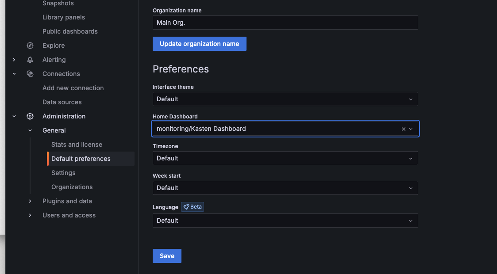

# Goal 

Show how to expose the Kasten dashboard using the grafana operator.

## Assumptions

We assume kasten is intalled in version 7.5 and greater in the kasten-io namespace.
For the kubernetes(non openshift) installation we assume you have the nginx ingress controller with certmanager.
We limit the scope of the grafana operator to the monitoring namespace.

# Change the password 

Edit [grafana.yaml](./grafana.yaml) and [grafana-openshift.yaml](./grafana-openshift.yaml) and change the `admin_password` field. 

# Install on openshift 

Use operator hub to install grafana operator in monitoring namespace, in my example I use the version 5.15.1.

```
oc create -f grafana-openshift.yaml
oc create -f grafana-route.yaml
oc create -f grafana-datasource.yaml
oc create -f grafana-dashboard.yaml
```

# Install on kubenetes 

Install the operator in monitoring namespace
```
helm upgrade -i grafana-operator oci://ghcr.io/grafana/helm-charts/grafana-operator --version v5.15.1 -n monitoring --create-namespace
```

```
kubectl create -f grafana.yaml
#Adapt the host to your configuration
HOST=grafana.eks-se.customers.kastenevents.com
cat <<EOF | kubectl create -f - 
apiVersion: networking.k8s.io/v1
kind: Ingress
metadata:
  annotations:
    cert-manager.io/cluster-issuer: letsencrypt-prod
    nginx.ingress.kubernetes.io/backend-protocol: HTTP
    nginx.ingress.kubernetes.io/force-ssl-redirect: "true"
  labels:    
  name: kasten
  namespace: monitoring  
spec:
  ingressClassName: nginx
  rules:
  - host: $HOST
    http:
      paths:
      - backend:
          service:
            name: kasten-service
            port:
              number: 3000
        path: /
        pathType: Prefix
  tls:
  - hosts:
    - $HOST
    secretName: kasten-tls
EOF
kubectl create -f grafana-datasource.yaml
kubectl create -f grafana-dashboard.yaml
```


# Make kasten the home dasboard 

To have immediately grafana as the home dashboard go in general > Default Preference > Home Dashboard and select monitorin/kasten as the home dashboard.


# Change the configuration of the grafana service in kasten 
```
--set grafana.external.url=<grafan_url>
```